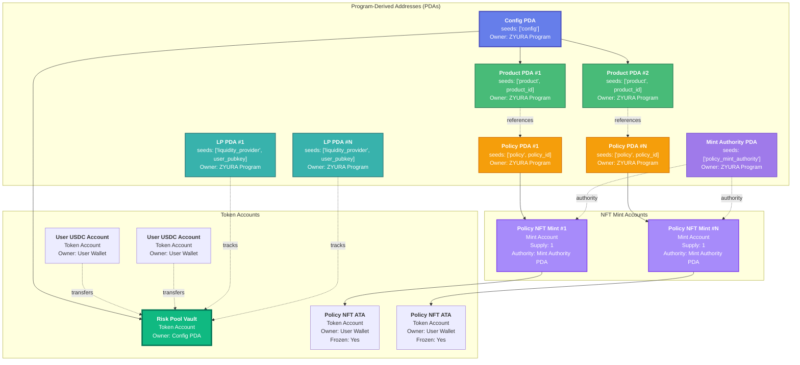
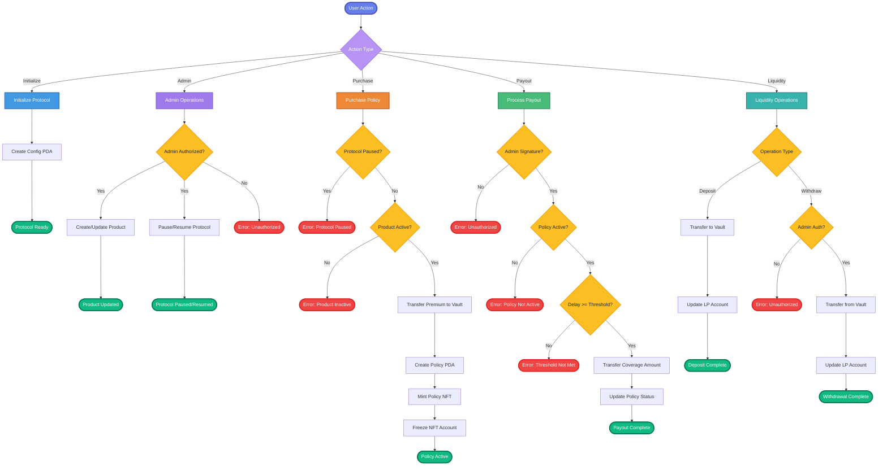
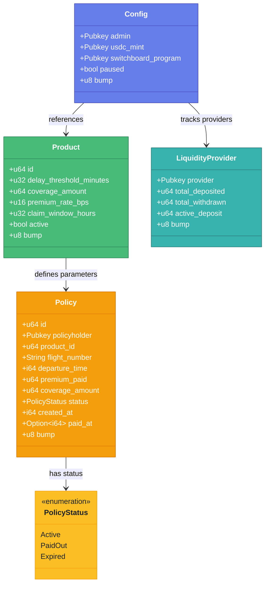
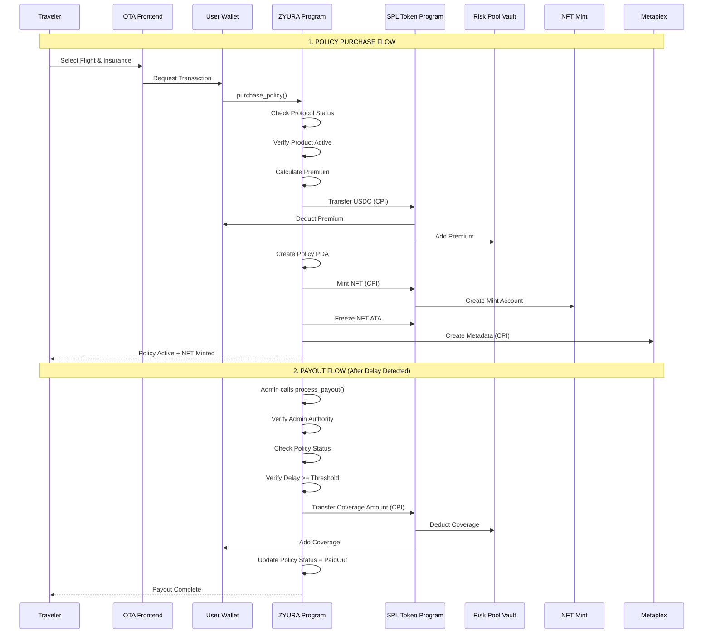
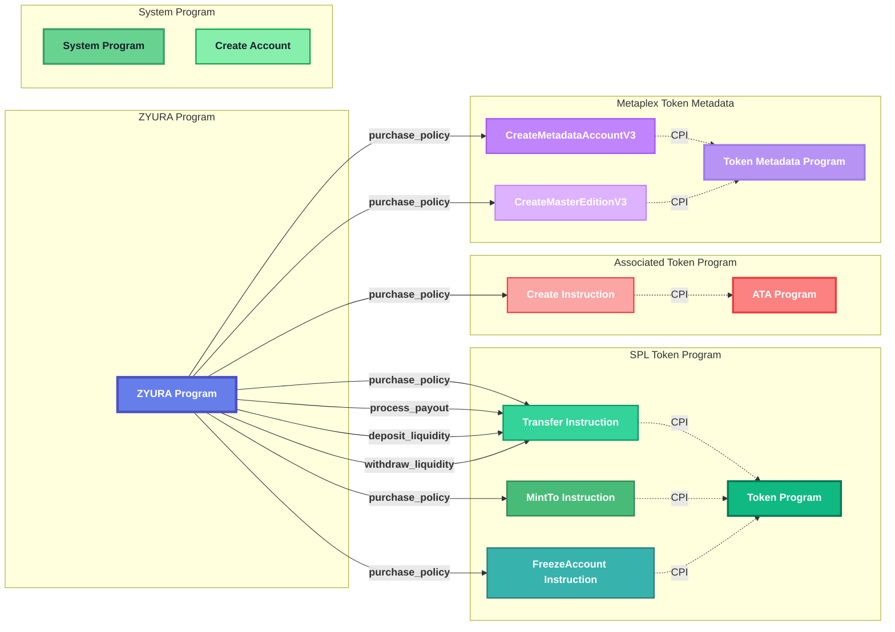
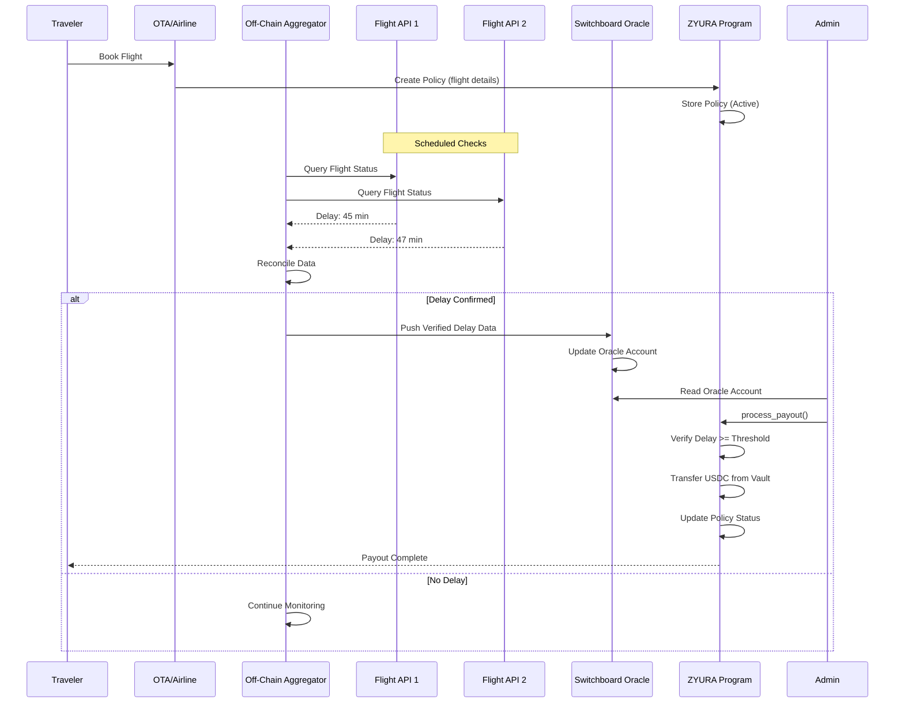
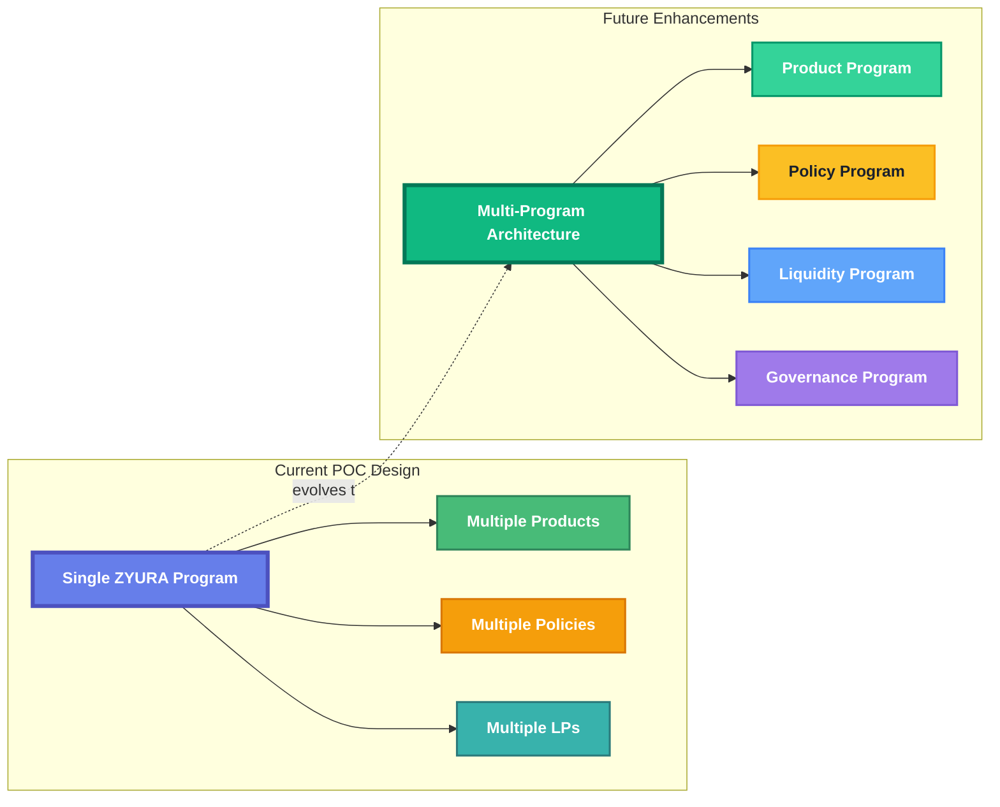

<div align="center">

# **ZYURA**

### Instant, fair, community‑owned flight‑delay insurance on Solana

[](https://github.com/alienx5499/ZYURA/actions)
[](https://solana.com/)
[](https://www.anchor-lang.com/)
[](https://github.com/alienx5499/ZYURA/blob/main/CONTRIBUTING.md)
[](https://github.com/alienx5499/ZYURA/blob/main/LICENSE)
[](https://solana.com/)
[](https://visitor-badge.laobi.icu/badge?page_id=alienx5499.ZYURA)
[](https://github.com/alienx5499/ZYURA/stargazers)
[](https://github.com/alienx5499/ZYURA/network)
[](https://github.com/alienx5499/ZYURA/commits/main)
[](https://github.com/alienx5499/ZYURA/issues)
[](https://github.com/alienx5499/ZYURA/pulls)
[](https://github.com/alienx5499/ZYURA)

<svg width="120" height="120" viewBox="200 200 650 650" xmlns="http://www.w3.org/2000/svg">
  <g transform="translate(0.000000,1024.000000) scale(0.100000,-0.100000)" fill="#000000" stroke="none">
    <path d="M6146 8078 c-10 -6 -247 -237 -525 -514 l-505 -503 -56 51 c-30 28 -147 142 -260 253 -113 111 -216 207 -228 214 -38 20 -63 7 -145 -78 -68 -70 -77 -83 -77 -116 0 -34 9 -46 78 -116 210 -212 569 -550 597 -564 45 -21 142 -20 182 3 32 17 331 310 869 853 279 281 284 287 284 327 0 45 -7 55 -100 139 -61 56 -86 67 -114 51z"/>
    <path d="M3093 6469 c-10 -10 -13 -281 -13 -1285 0 -1376 0 -1376 54 -1600 56 -230 144 -386 326 -578 104 -109 201 -185 440 -345 113 -75 359 -241 547 -369 420 -285 586 -392 637 -409 36 -13 43 -12 90 11 29 14 143 85 253 158 111 73 343 225 514 338 172 113 356 236 408 274 246 179 455 377 553 526 161 245 214 436 223 805 3 110 7 695 10 1300 4 993 1 1170 -18 1176 -1 0 -904 3 -2007 6 -1648 4 -2007 3 -2017 -8z m3684 -364 c14 -18 15 -140 9 -1110 -3 -679 -10 -1124 -16 -1180 -51 -419 -242 -652 -881 -1071 -107 -70 -301 -198 -431 -285 -289 -193 -331 -215 -367 -199 -42 19 -1005 665 -1131 759 -232 172 -412 385 -464 549 -73 233 -78 321 -74 1518 3 970 4 1003 22 1023 l19 21 1649 -2 c1636 -3 1650 -3 1665 -23z"/>
    <path d="M3814 5749 c-13 -20 -17 -570 -5 -589 8 -12 39 -15 168 -15 l158 0 10 120 c6 66 14 126 18 133 7 10 163 13 805 12 788 -1 897 -4 886 -22 -3 -5 -74 -70 -158 -146 -84 -75 -314 -283 -512 -462 -197 -179 -435 -393 -529 -474 -93 -82 -231 -206 -305 -275 -74 -69 -219 -202 -322 -295 -103 -93 -185 -172 -183 -176 5 -8 185 -148 403 -314 64 -48 285 -200 490 -338 298 -199 378 -248 395 -242 40 12 798 512 962 635 114 85 221 196 262 275 64 119 68 157 68 571 0 204 -3 375 -8 379 -4 4 -24 -8 -45 -28 -20 -20 -95 -81 -167 -138 l-129 -102 3 -251 c3 -250 2 -252 -21 -287 -26 -38 -54 -61 -258 -209 -165 -121 -655 -441 -674 -441 -20 0 -637 426 -736 507 -9 8 267 257 695 629 132 114 364 323 515 465 151 141 369 341 485 445 115 104 237 214 270 245 l60 57 3 138 c2 75 1 151 -2 168 l-6 31 -1294 4 c-1086 3 -1295 1 -1302 -10z"/>
  </g>
</svg>

</div>

---

## 🎯 **What is ZYURA?**

ZYURA transforms traditional travel insurance from a slow, opaque process into **instant, AI-powered, community-governed flight delay protection** on Solana. When your flight is delayed beyond a defined threshold, smart contracts automatically trigger **instant USDC payouts**—no claims forms, no adjusters, no waiting.

Real-time oracle data (via Switchboard) is the source of truth, and all terms, payouts, and accounting are **100% transparent on-chain**.

> **📌 POC Focus:** This Proof-of-Concept focuses exclusively on **parametric flight delay insurance** to prove the off-chain data pipeline and on-chain payout integrity. The goal is to demonstrate instant, automated payouts based on verified oracle data, evolving into a community-governed, surplus-sharing model.

### 🌟 **Key Features**

- ⚡ **Instant Claims Processing**: Sub-second payouts through automated smart contract execution
- 🏛️ **Community Ownership**: Democratic governance and surplus redistribution to policyholders
- 💰 **Micro-Insurance Accessibility**: Affordable, event-based coverage embedded at checkout
- 🔒 **Transparent & Auditable**: All policy terms, oracle checks, and payouts on-chain
- 🎫 **NFT Policy Proof**: Immutable, soulbound NFTs as proof of insurance
- 🌐 **Oracle-Verified**: Switchboard oracle integration for reliable flight delay data

> Protect your flights, get paid instantly. No paperwork, no waiting.

<div align="center">

### Build with us

Need instant flight‑delay protection? You’re exactly who we built this for.

<a href="https://github.com/alienx5499/ZYURA">
  
</a>

<a href="https://twitter.com/intent/tweet?text=🔥%20WOW!%20ZYURA%20is%20revolutionizing%20flight%20delay%20insurance%20on%20Solana!%20Instant%20payouts,%20transparent%20on-chain,%20no%20paperwork!%20🚀✨%0AIf%20you%20travel%20frequently%20or%20want%20decentralized%20insurance%20-%20you%20NEED%20this!%20%F0%9F%9A%80%0Ahttps://github.com/alienx5499/ZYURA%0A@alienx5499">

</a>

Every star helps us build a more transparent and accessible insurance future.

</div>

---

## 📚 **Table of Contents**

1. [✨ Features](#-features)
2. [🎯 Value Proposition & Market Fit](#-value-proposition--market-fit)
3. [👥 Target Users & User Stories](#-target-users--user-stories)
4. [🦾 Tech Stack](#-tech-stack)
5. [📂 Project Structure](#-project-structure)
6. [🚀 Quick Start](#-quick-start)
7. [👨‍🔧 Detailed Setup](#-detailed-setup)
8. [🏗️ Architecture](#️-architecture)
9. [📊 Architecture Diagrams](#-architecture-diagrams)
10. [🔐 Security & Access Control](#-security--access-control)
11. [🤝 Contributing](#-contributing)
12. [🌟 Awesome Contributors](#-awesome-contributors)
13. [📜 License](#-license)
14. [📬 Feedback & Suggestions](#-feedback--suggestions)

---

## ✨ **Features**

### ⚡ **Instant Payouts**

- Automated smart contract execution upon verified delays
- Sub-second USDC transfers from risk pool vault
- No manual claims processing required
- Oracle-triggered parametric insurance model

### 🎫 **NFT Policy Management**

- **Soulbound NFTs**: Non-transferable policy proof tokens
- **On-Chain Metadata**: All policy details stored immutably
- **Metaplex Integration**: Standard NFT format for compatibility
- **Policy Tracking**: Easy portfolio management
 - **Metadata Hosting**: SVG images and JSON metadata for minted policy NFTs are stored in a public GitHub repository per wallet folder: [`zyura-nft-metadata`](https://github.com/alienx5499/zyura-nft-metadata). The frontend uploads assets via an internal API to that repo for transparent, durable hosting.

### 🔍 **Oracle Integration**

- **Switchboard Oracle**: Real-time flight delay data
- **Multi-Source Aggregation**: Reliable data verification
- **Threshold-Based Triggers**: Configurable delay thresholds
- **Transparent Verification**: All checks auditable on-chain

### 💰 **Liquidity Management**

- **Liquidity Provider Support**: Earn yield on risk pool
- **Transparent Accounting**: All deposits/withdrawals on-chain
- **Admin-Controlled Withdrawals**: Security-focused design
- **Active Deposit Tracking**: Real-time LP positions

### 🏛️ **Protocol Controls**

- **Pause Mechanism**: Emergency protocol pause capability
- **Product Management**: Multiple insurance products supported
- **Admin Controls**: Secure administrative operations
- **Configurable Parameters**: Flexible product definitions

---

## 🎯 **Value Proposition & Market Fit**

### **Core Value Proposition**

ZYURA transforms traditional travel insurance from a slow, opaque process into instant, AI-powered, community-governed flight delay protection on Solana. For this POC, we focus exclusively on **parametric flight delay insurance**: when a covered flight is delayed beyond a defined threshold, smart contracts automatically trigger instant USDC payouts—no claims forms or adjusters.

**Key Value Areas:**
1. **Instant Claims Processing**: Sub-second payouts through automated smart contract execution
2. **Community Ownership**: Democratic governance and surplus redistribution to policyholders
3. **Micro-Insurance Accessibility**: Affordable, event-based coverage embedded at checkout

**Product-Market Fit:**
Flight delays are frequent, verifiable events that cause real traveler pain. Traditional travel insurance is paperwork-heavy and slow; parametric payouts reduce friction to near-zero. Solana's speed and low fees make instant micro-payouts viable, while community governance enables transparent surplus sharing and aligned incentives with travelers.

### **Target Markets**

1. **Frequent Travelers (Primary)**: Business and leisure travelers who want instant compensation for flight delays without paperwork
2. **Travel Platforms & OTAs (Distribution)**: Online travel agencies, airline partners, and booking apps that can bundle parametric cover at checkout
3. **Corporate Travel (Secondary)**: Companies with frequent traveler populations that value automated reimbursements and reduced admin overhead
4. **DeFi-Native Users (Early Adopters)**: Crypto-savvy travelers and liquidity providers willing to bootstrap the risk pool and showcase on-chain transparency

### **Competitive Advantages**

- **Instant Payouts**: Deterministic, on-chain execution upon oracle-verified delays
- **Lower Costs**: Minimal overhead via automation; micro-premiums viable on Solana
- **Transparency**: Policy terms, oracle checks, and payouts are auditable on-chain
- **Community Ownership**: Surplus sharing and governance align incentives with travelers

### **Competitor Landscape**

**Direct Competitors:**
- **Allianz Travel, World Nomads, AXA**: Conventional travel insurance—manual claims, slower payouts, higher overhead
- **Parametric Flight Products**: Automated payouts but limited availability and opaque processing

**Adjacent Competitors:**
- **Airlines/OTAs with vouchers/credits**: Often restrictive, not instant cash, lack transparency
- **DeFi Insurance Protocols (Nexus Mutual, InsurAce)**: Strong on crypto-native risks; limited real-world parametrics with dependable off-chain pipelines

### **Key Challenges & Considerations**

Based on adversarial analysis, ZYURA addresses several critical considerations:

**1. Regulatory Challenges**
- Insurance is heavily regulated across jurisdictions
- **Mitigation**: Parametric insurance model reduces regulatory complexity compared to traditional insurance
- Focus on transparent, on-chain compliance

**2. Oracle Reliability**
- Dependence on external data sources creates potential single points of failure
- **Mitigation**: Switchboard-based aggregation with multi-source reconciliation and on-chain freshness checks
- Robust off-chain pipelines as a key technical moat

**3. Market Education**
- Users may need education on decentralized insurance
- **Approach**: Start with DeFi-native early adopters, then expand to broader markets
- Transparent on-chain operations build trust over time

**4. Competition from Incumbents**
- Large insurers could replicate the model
- **Advantage**: Technical barriers and Solana's cost/speed advantages create differentiation
- Community ownership model creates sustainable competitive advantages

**5. Market Size**
- Micro-insurance revenue sustainability concerns
- **Positioning**: Low overhead via automation makes micro-premiums viable
- Embedded checkout distribution expands addressable market

### **Founder-Market Fit**

**Strengths:**
- Technical proficiency in blockchain development and Solana architecture
- Experience integrating data oracles and designing parametric triggers
- Understanding of DeFi protocols and community-driven projects
- Network access to DeFi developers, travel-tech founders, and oracle providers

**Areas for Development:**
- Deeper regulatory knowledge of insurance compliance across jurisdictions
- Enhanced understanding of actuarial science and risk modeling
- Stronger connections to traditional insurance industry stakeholders
- Need for insurance industry advisors and legal counsel

**Strategy:**
- Emphasize technical expertise and community understanding as core strengths
- Build partnerships with existing insurance providers
- Engage regulatory advisors early in development

---

## 👥 **Target Users & User Stories**

### **Prioritized User Types (POC Focus)**

1. **Travelers**: Purchase cover at checkout and receive instant payouts
2. **OTA/Airline Operators**: Integrate and manage distribution channels
3. **Liquidity Providers**: Deposit USDC into risk pool for yield
4. **Protocol Admin**: Configure parameters and manage emergency controls

### **Key User Functions**

#### **Traveler Functions**
- View flight-delay products and coverage thresholds
- Purchase/activate cover at checkout (select flight, pay premium)
- View active policy (flight, window, cap)
- Receive auto payout when delay threshold is verified
- View payout history and receipts

#### **OTA/Airline Operator Functions**
- Configure product placement and checkout flow
- Pass flight identifiers and booking refs to on-chain policy creation
- Monitor payout status and customer notifications

#### **Liquidity Provider Functions**
- Deposit USDC into risk pool
- View pool metrics (utilization, losses, surplus)
- Withdraw liquidity (subject to admin approval)
- Track active deposits and yields

#### **Protocol Admin Functions**
- Configure product parameters (threshold, premium rate, coverage cap)
- Manage oracle feeds and freshness thresholds
- Pause/resume product in emergencies
- Process payouts after oracle verification

### **Critical User Stories**

1. **Traveler purchases a flight-delay parametric cover at checkout and later receives instant payout upon an oracle-verified delay**
2. **Liquidity provider deposits USDC into the pool and accrues surplus, with the system honoring payouts from the pool**

### **On-Chain Requirements**

#### **Core Requirements**

- **Product Registry**: Flight-delay parameters (threshold minutes, coverage cap, premium rate, claim window)
  - Product registry account stores available insurance types
  - Each product has unique identifier and display parameters
  - Readable by any user without transaction fees
  
- **Policy Creation**: Store traveler, flight identifier, coverage window, and premium paid
  - Policy minting function creates new policy account
  - Stores: policyholder address, product type, premium paid, coverage start/end times, coverage amount
  - Transfers USDC from user to risk pool vault
  - Fails if insufficient USDC balance or product is paused
  
- **Oracle Pipeline**: Switchboard integration with multi-source reconciliation and freshness checks
  - Oracle verification function checks external data against policy terms
  - Multi-source data aggregation and reconciliation
  - On-chain freshness validation to prevent replay attacks
  
- **Payout System**: Transfer USDC to traveler and mark policy paid
  - Payout function transfers USDC from risk pool to policyholder
  - Updates policy state to prevent double-payouts
  - Fails if policy expired, already paid, or risk pool underfunded
  
- **Risk Pool**: Vault, LP shares accounting, surplus ledger
  - Risk pool vault account holds USDC
  - Share tracking system records each LP's contribution
  - Surplus ledger tracks excess funds
  
- **LP Management**: Deposit/withdraw flows with share tracking
  - Deposit function calculates and mints LP shares based on current pool value
  - Handles empty pool case (first deposit gets 1:1 shares)
  - Withdrawal respects lockup periods and prevents underfunding
  
- **Admin Controls**: Parameters and pause switch
  - Pause flag stored in global program state
  - All policy creation functions check pause status
  - Admin-restricted pause/unpause operations

#### **Technical Considerations**

- **Account Rent**: All accounts must maintain minimum SOL balance for rent exemption
- **Transaction Fees**: Users pay SOL for transaction fees; program handles rent requirements
- **USDC Token Program Integration**: All transfers use SPL Token Program via CPI
- **Emergency Procedures**: Pause mechanism for protocol emergencies
- **Query Capabilities**: Policy data readable without transaction fees for frontend queries

#### **Edge Cases & Error Handling**

- **Pool Underfunding**: Withdrawals blocked if would leave insufficient funds for active policies
- **Policy Expiration**: Policies expire after claim window; no payouts after expiration
- **Oracle Failures**: Admin can manually verify and process payouts if oracle data unavailable
- **Double Payout Prevention**: Policy status tracked to prevent multiple payouts
- **Product Pause**: Policy purchases blocked when product paused; existing policies unaffected

---

## 🦾 **Tech Stack**

### ⛓️ **Blockchain**

- **Solana**: High-performance blockchain for instant transactions
- **Anchor Framework**: Secure program development
- **Switchboard**: Oracle network for flight data
- **Metaplex**: NFT metadata and standards
- **SPL Token**: Token program for USDC and NFTs

### 🌐 **Frontend**

- **Next.js 16**: React framework with App Router
- **TypeScript**: Type-safe development
- **Tailwind CSS**: Modern styling
- **@solana/wallet-adapter**: Wallet integration
- **@coral-xyz/anchor**: Solana program interaction

### 🛠️ **Development Tools**

- **Anchor CLI**: Build and deploy Solana programs
- **Solana CLI**: Blockchain interaction
- **pnpm**: Fast package manager
- **TypeScript**: Type checking
- **ESLint**: Code quality

---

## 📂 **Project Structure**

```
ZYURA/
├── contracts/                    # Solana program (Anchor)
│   ├── programs/
│   │   └── zyura/               # Main program source
│   │       ├── src/
│   │       │   ├── lib.rs       # Program entry point
│   │       │   ├── instructions/ # Instruction handlers
│   │       │   │   ├── initialize.rs
│   │       │   │   ├── admin.rs
│   │       │   │   ├── product.rs
│   │       │   │   ├── policy.rs
│   │       │   │   └── liquidity.rs
│   │       │   ├── state/       # Account state definitions
│   │       │   └── errors/      # Custom error types
│   │       └── Cargo.toml
│   ├── tests/                   # Integration tests
│   ├── migrations/              # Deployment scripts
│   ├── Anchor.toml             # Anchor configuration
│   └── package.json
│
├── frontend/                     # Next.js web application
│   ├── src/
│   │   ├── app/                 # Next.js App Router
│   │   │   ├── page.tsx         # Landing page
│   │   │   ├── dashboard/       # Dashboard pages
│   │   │   └── layout.tsx
│   │   ├── components/          # React components
│   │   │   ├── ui/             # UI component library
│   │   │   └── ...
│   │   ├── contexts/           # React contexts
│   │   │   ├── WalletConnectionProvider.tsx
│   │   │   └── AuthContext.tsx
│   │   ├── hooks/              # Custom hooks
│   │   ├── lib/                # Utilities
│   │   └── idl/                # Program IDL
│   ├── scripts/                # Admin scripts
│   │   ├── admin.ts
│   │   ├── purchase.ts
│   │   ├── payout.ts
│   │   └── deposit.ts
│   ├── public/                 # Static assets
│   └── package.json
│
├── .gitignore
└── README.md                    # This file
```

### 📁 **Key Directories**:

- **`contracts/programs/zyura/src/`**: Solana program source code with instruction handlers
- **`contracts/tests/`**: Integration tests for the program
- **`frontend/src/app/`**: Next.js App Router with pages and layouts
- **`frontend/src/components/`**: React components and UI library
- **`frontend/scripts/`**: Admin and interaction scripts
- **`frontend/src/idl/`**: Anchor IDL (Interface Definition Language) files

---

## 🚀 **Quick Start**

### **Prerequisites**

- **Node.js** 18+ and **pnpm**
- **Rust** and **Solana CLI** installed
- **Anchor** framework installed
- **Solana wallet** (Phantom recommended)

### **1. Clone & Install**

```bash
# Clone the repository
git clone https://github.com/alienx5499/ZYURA.git
cd ZYURA

# Install contract dependencies
cd contracts
pnpm install

# Install frontend dependencies
cd ../frontend
pnpm install
```

### **2. Build & Deploy Contracts**

```bash
cd contracts

# Build the program
anchor build

# Deploy to devnet
anchor deploy

# Run tests
anchor test
```

### **3. Run Frontend**

```bash
cd frontend

# Start development server
pnpm dev

# Open http://localhost:3000
```

### **4. Run Contracts Tests on Surfpool (Localnet)**

1. Install Surfpool (one-time):
   ```bash
   curl -sL https://run.surfpool.run/ | bash
   ```
2. Start Surfpool (surfnet) in another terminal:
   ```bash
   surfpool start
   ```
3. In `contracts/`, run Anchor tests against Surfpool without starting the built-in validator:
   ```bash
   anchor test --skip-local-validator
   ```
   This reuses the Surfpool instance running at `http://localhost:8899`.

---

## 👨‍🔧 **Detailed Setup**

### **Prerequisites Installation**

1. **Install Rust**:
   ```bash
   curl --proto '=https' --tlsv1.2 -sSf https://sh.rustup.rs | sh
   ```

2. **Install Solana CLI**:
   ```bash
   sh -c "$(curl -sSfL https://release.solana.com/stable/install)"
   ```

3. **Install Anchor**:
   ```bash
   cargo install --git https://github.com/coral-xyz/anchor avm --locked --force
   avm install latest
   avm use latest
   ```

4. **Setup Solana Wallet**:
   ```bash
   solana-keygen new
   solana config set --url devnet
   ```

### **Contract Setup**

```bash
cd contracts

# Install dependencies
pnpm install

# Build the program
anchor build

# Run tests
anchor test

# Deploy to devnet
anchor deploy
```

### **Frontend Setup**

```bash
cd frontend

# Install dependencies
pnpm install

# Copy environment variables (if needed)
cp .env.example .env.local

# Start dev server
pnpm dev
```

### **Admin Scripts**

```bash
cd frontend

# Initialize protocol (admin only)
pnpm admin initialize

# Create product
pnpm admin create-product

# Update product
pnpm update

# Process payout
pnpm payout

# Deposit liquidity
pnpm deposit
```

---

## 🏗️ **Architecture**

### **Program Structure**

ZYURA consists of a single Anchor program that manages:

- **Config PDA**: Protocol configuration and admin controls
- **Product PDAs**: Insurance product definitions
- **Policy PDAs**: Individual policy accounts with NFT proof
- **LP PDAs**: Liquidity provider tracking
- **Risk Pool Vault**: Central USDC vault for premiums and payouts

### **Key Instructions**

- `initialize` - Initialize the protocol (admin only)
- `create_product` - Create a new insurance product
- `update_product` - Update product parameters
- `purchase_policy` - Purchase flight delay insurance
- `process_payout` - Admin-triggered payout for eligible policies
- `deposit_liquidity` - LP deposits to risk pool
- `withdraw_liquidity` - LP withdrawals (admin approved)
- `set_pause_status` - Pause/resume protocol

### **Account Types**

- **PDAs**: Program-Derived Addresses (owned by ZYURA Program)
- **Token Accounts**: SPL Token Accounts (ATA = Associated Token Account)
- **Mint Accounts**: Token mint accounts (NFT and USDC)
- **Metadata Accounts**: Metaplex metadata PDAs

### **Program ID**

- **Devnet**: `DWErB1gSbiBBeEaXzy3KEsCbMZCD6sXmrVT9WF9mZgxX`

For complete architecture diagrams and flow charts, see [3.assignment.md](../3.assignment.md).

---

## 📊 **Architecture Diagrams**

### **1. Core Program Architecture**

The ZYURA protocol consists of a single Anchor program (`zyura`) that manages all insurance operations through modular instruction handlers.

```mermaid
graph TB
    subgraph "ZYURA Program"
        ZP["<b>ZYURA Program</b><br/>DWErB1gSbiBBeEaXzy3KEsCbMZCD6sXmrVT9WF9mZgxX"]
        
        subgraph "Instruction Modules"
            INIT["<b>Initialize</b>"]
            PROD["<b>Product Management</b>"]
            POLICY["<b>Policy Operations</b>"]
            LIQ["<b>Liquidity Management</b>"]
            ADMIN["<b>Admin Controls</b>"]
        end
        
        ZP --> INIT
        ZP --> PROD
        ZP --> POLICY
        ZP --> LIQ
        ZP --> ADMIN
    end
    
    subgraph "External Programs"
        SPL["<b>SPL Token Program</b>"]
        ATA["<b>Associated Token Program</b>"]
        SYS["<b>System Program</b>"]
        META["<b>Metaplex Token Metadata</b>"]
        SWB["<b>Switchboard Oracle</b>"]
    end
    
    ZP -.CPI.-> SPL
    ZP -.CPI.-> ATA
    ZP -.CPI.-> SYS
    ZP -.CPI.-> META
    ZP -.Reads.-> SWB
    
    style ZP fill:#667eea,stroke:#4c51bf,stroke-width:4px,color:#fff
    style INIT fill:#4299e1,stroke:#2b6cb0,stroke-width:2px,color:#fff
    style PROD fill:#48bb78,stroke:#2f855a,stroke-width:2px,color:#fff
    style POLICY fill:#ed8936,stroke:#c05621,stroke-width:2px,color:#fff
    style LIQ fill:#38b2ac,stroke:#2c7a7b,stroke-width:2px,color:#fff
    style ADMIN fill:#9f7aea,stroke:#805ad5,stroke-width:2px,color:#fff
    style SPL fill:#f6ad55,stroke:#dd6b20,stroke-width:2px,color:#1a202c
    style ATA fill:#fc8181,stroke:#e53e3e,stroke-width:2px,color:#fff
    style SYS fill:#68d391,stroke:#38a169,stroke-width:2px,color:#1a202c
    style META fill:#b794f4,stroke:#9f7aea,stroke-width:2px,color:#fff
    style SWB fill:#fbbf24,stroke:#f59e0b,stroke-width:3px,color:#1a202c
```



### **2. Account Hierarchy and Ownership**



### **3. Instruction Flow Diagram**



### **4. Account Data Structures**



### **5. User Journey: Purchase to Payout**



### **6. Cross-Program Invocations (CPIs)**



### **7. Oracle Data Flow**

How flight delay data flows from external sources to on-chain payouts:



### **8. CPI Instruction Mapping**

| ZYURA Instruction | CPI Target Program | CPI Instruction | Purpose |
|------------------|-------------------|------------------|---------|
| `purchase_policy` | SPL Token | `transfer` | Transfer premium to vault |
| `purchase_policy` | SPL Token | `mint_to` | Mint policy NFT |
| `purchase_policy` | SPL Token | `freeze_account` | Freeze NFT account (soulbound) |
| `purchase_policy` | Associated Token | `create` | Create NFT ATA |
| `purchase_policy` | Metaplex | `CreateMetadataAccountV3` | Create NFT metadata |
| `purchase_policy` | Metaplex | `CreateMasterEditionV3` | Create NFT master edition |
| `process_payout` | SPL Token | `transfer` | Transfer coverage from vault |
| `deposit_liquidity` | SPL Token | `transfer` | Transfer USDC to vault |
| `withdraw_liquidity` | SPL Token | `transfer` | Transfer USDC from vault |

For more detailed architecture diagrams including PDA derivation, external integrations, user flows, and security models, see [3.assignment.md](../3.assignment.md).

---

## 🔐 **Security & Access Control**

### **Security Features**

- **Admin-Controlled Operations**: Critical operations require admin signature
- **Protocol Pause Mechanism**: Emergency pause capability for protocol-wide halts
- **Product-Level Activation**: Individual product activation controls
- **NFT Account Freezing**: Soulbound token behavior (non-transferable policies)
- **Oracle Verification**: Switchboard oracle data verification with freshness checks
- **Threshold-Based Payouts**: Configurable delay thresholds per product
- **Double-Payout Prevention**: Policy status tracking prevents multiple payouts
- **Account Rent Management**: All PDAs properly funded to avoid rent exemption issues

### **Authority Checks**

All instructions implement comprehensive authority validation:

- **Initialize**: One-time initialization, fails if config already exists
- **Admin Operations**: All admin functions verify admin signature from Config PDA
- **Policy Purchase**: Checks protocol pause status, product activation, and sufficient premium
- **Payout Processing**: Verifies admin authority, policy status, delay threshold, and pool funds
- **Liquidity Operations**: Deposit checks pause status; withdrawal requires admin approval

### **Error Handling**

| Error Condition | Instruction | Error Code | Recovery Path |
|----------------|-------------|------------|---------------|
| Protocol Paused | purchase_policy, deposit_liquidity | ProtocolPaused | Admin must unpause |
| Product Inactive | purchase_policy | ProductInactive | Admin must activate product |
| Insufficient Premium | purchase_policy | InsufficientPremium | User must increase premium |
| Unauthorized | Admin operations | Unauthorized | Verify admin keypair |
| Policy Not Active | process_payout | PolicyNotActive | Policy already paid/expired |
| Delay Threshold Not Met | process_payout | DelayThresholdNotMet | Delay insufficient for payout |
| Insufficient Balance | withdraw_liquidity | InvalidAmount | LP must reduce amount |

### **Design Rationale**

Key architectural decisions and their rationale:

**1. PDA-Based Accounts**
- All protocol accounts use PDAs for deterministic address derivation
- Program ownership guarantees security and control
- Reduced key management overhead compared to keypair-based accounts

**2. NFT as Policy Proof**
- Immutable proof of insurance purchase stored on-chain
- Non-transferable (frozen) to prevent policy trading and maintain authenticity
- Metadata storage enables rich policy information and frontend display
- Standard Metaplex format ensures compatibility with NFT wallets and marketplaces

**3. Admin-Controlled Payouts**
- Payouts require admin signature to enable oracle verification before on-chain execution
- Allows manual review of edge cases and disputed claims
- Prevents automated abuse in POC phase while maintaining flexibility for future automation

**4. Single Vault Design**
- One risk pool vault simplifies liquidity management
- Easier accounting and auditing with centralized fund tracking
- Clear separation of protocol funds from user wallets

**5. Parametric Insurance Model**
- Event-based triggers (flight delays) reduce regulatory complexity
- Eliminates need for subjective claims assessment
- Enables instant, automated payouts upon oracle verification

**6. Oracle Integration Strategy**
- Switchboard oracle provides reliable flight delay data
- Multi-source aggregation improves data reliability
- On-chain freshness checks prevent replay attacks and stale data

### **Scalability Considerations**



**Current POC Design:**
- Single monolithic Anchor program for simplicity
- Multiple products, policies, and LPs supported within one program
- PDA-based architecture enables horizontal scaling

**Future Enhancements:**
- Multi-program architecture with separate programs for products, policies, liquidity, and governance
- Program decomposition for better upgradeability and modularity
- Enhanced governance mechanisms for community-driven decisions

---

## 🤝 **Contributing**

We ❤️ open source! Your contributions make this project better.

### **How to Contribute**

1. **Fork the Repository**
   ```bash
   git clone https://github.com/your-username/ZYURA.git
   ```

2. **Create Feature Branch**
   ```bash
   git checkout -b feature/amazing-feature
   ```

3. **Commit Changes**
   ```bash
   git commit -m "Add amazing feature"
   ```

4. **Push to Branch**
   ```bash
   git push origin feature/amazing-feature
   ```

5. **Open Pull Request**

### **Contribution Guidelines**

- Follow the existing code style
- Add tests for new features
- Update documentation
- Keep commits clean and meaningful
- Test on devnet before submitting

---

##  **Awesome Contributors**

<div align="center">
	<h3>Thank you for contributing to our repository</h3><br>
	<p align="center">
		<a href="https://github.com/alienx5499/ZYURA/contributors">
			
		</a>
	</p>
</div>

---

## 📜 **License**

This project is licensed under the **MIT License**. See [LICENSE](./LICENSE) for full terms.

Unless otherwise noted in a file header, all source code in this repository is provided under the MIT License. Individual files or components that include their own license headers remain under those specified terms.

---

<div align="center">

### 📬 **Feedback & Suggestions**

_We value your input! Share your thoughts through [GitHub Issues](https://github.com/alienx5499/ZYURA/issues)._

💡 _Let's work together to build a more transparent and accessible insurance future on Solana!_

**🚀 LFG!**

</div>

---

## 📖 **Reference Documents**

For detailed analysis and comprehensive documentation, see the following capstone assignment documents:

### 📊 **Strategic Foundation**

📄 **[Project Definition & Market Analysis](./project-definition.md)**
- Core value proposition and product-market fit assessment
- Target market identification and prioritization
- Competitive landscape analysis (direct and adjacent competitors)
- Founder-market fit assessment with strengths and development areas
- Adversarial analysis and key challenges (regulatory, oracle reliability, market education)
- AI-assisted analysis process and refinement methodology

### 👥 **User Requirements & Specifications**

📄 **[User Stories & On-Chain Requirements](./user-requirements.md)**
- Prioritized user types for POC focus (Travelers, OTA Operators, LPs, Admins)
- Core function mapping by user role
- Critical user stories and use cases
- Detailed on-chain requirements per user story
- Edge cases and error handling specifications
- Account rent and transaction fee considerations
- Refinement process (de-jargon, granularity, atomicity checks)

### 🏗️ **Technical Architecture**

📄 **[Architecture Design Documentation](./architecture-design.md)**
- Complete architecture diagrams (8+ comprehensive diagrams)
- Account structure mapping and PDA derivation processes
- Instruction flow diagrams and user interaction flows
- Cross-program invocation (CPI) mapping
- External dependencies and oracle integration
- Security model and access control mechanisms
- Design rationale and scalability considerations
- Account management details and state transitions

---

**💡 Note:** These documents provide the complete strategic foundation, user requirements, and technical architecture for the ZYURA protocol. They demonstrate the iterative refinement process combining AI assistance, manual analysis, and adversarial critique.

